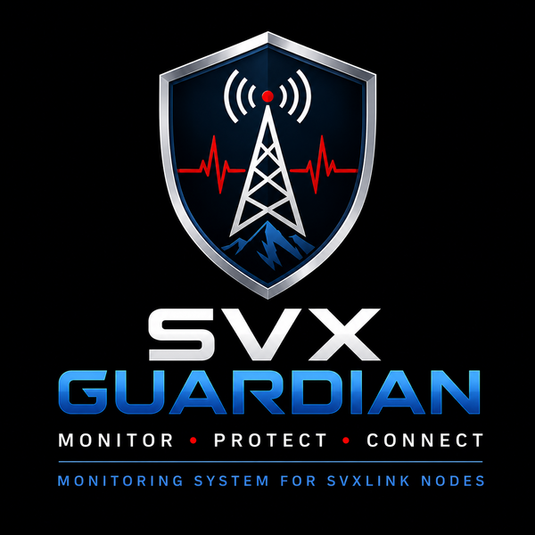

<p align="center">
  
</p>

<h1 align="center">SVX Guardian</h1>

<p align="center">
<b>Built by radio amateurs, for radio amateurs.</b>
</p>

<p align="center">
Open Source Monitoring Platform for SvxLink Radio Nodes
</p>

<p align="center">
<a href="README.md">🇮🇹 Italiano</a> · 🇬🇧 <b>English</b>
</p>

---

## Overview

**SVX Guardian** is an open-source monitoring and supervision platform designed for radio nodes based on **SvxLink**.

The goal of the project is to provide Sysops with a clear and immediate view of the entire node through a modern, responsive web dashboard suitable for both desktop and mobile devices.

Guardian monitors the Linux/Raspberry Pi system, the SvxLink service, EchoLink, Reflector and the operational log, while keeping data acquisition logic separate from presentation.

The project is developed with particular attention to:

- reliability;
- lightweight operation;
- modularity;
- compatibility with real SvxLink installations;
- responsive user interface;
- multilingual support;
- maintainability;
- future extensibility.

---

## Current Features

### System Monitoring

- ✅ Linux / Raspberry Pi system status
- ✅ CPU temperature
- ✅ CPU usage
- ✅ RAM usage
- ✅ Disk usage
- ✅ System uptime
- ✅ Host and platform information

### SvxLink Monitoring

- ✅ SvxLink service status
- ✅ Process PID
- ✅ Service uptime
- ✅ SvxLink configuration reading
- ✅ Configured Logic and module detection
- ✅ RX and TX information
- ✅ `node_info.json` support
- ✅ Compatibility with legacy SvxLink configurations

### EchoLink

- ✅ EchoLink status
- ✅ Directory status
- ✅ Connected stations
- ✅ Transmission state
- ✅ Recent connection history
- ✅ Unstable connection detection
- ✅ Operational station information

### Reflector

- ✅ Reflector connection status
- ✅ Host and port
- ✅ Default TalkGroup
- ✅ Active TalkGroup
- ✅ Talker status
- ✅ Connected SvxLink node monitoring

> Separate detection of users connected through Reflector clients/applications is currently under development.

### Web Dashboard

- ✅ General dashboard
- ✅ `/monitor` operational view
- ✅ System page
- ✅ SvxLink page
- ✅ EchoLink page
- ✅ Reflector page
- ✅ Responsive desktop and mobile interface
- ✅ Multilingual support

### Real-time RAW LOG

SVX Guardian includes a real-time viewer for the original SvxLink log.

The content deliberately remains **RAW**, without Guardian reinterpretation, allowing the Sysop to inspect exactly what SvxLink is producing.

Available features:

- ✅ Incremental logfile reading
- ✅ Real-time updates
- ✅ LIVE / Pause / Play
- ✅ Recovery of events generated while paused
- ✅ Auto-scroll ON/OFF
- ✅ Clear display without modifying the logfile
- ✅ 500-line visual buffer
- ✅ Log rotation and truncation handling
- ✅ No modification of the original `/var/log/svxlink` logfile

### Control and Authentication

- ✅ Sysop / Co-Sysop authentication
- ✅ Protected web sessions
- ✅ CSRF protection
- ✅ Private `SECRET_KEY` stored outside the repository
- ✅ Credentials and private installation configuration separated from public source code
- ✅ Authentication-protected node control functions

### REST API

- ✅ Guardian current-state export
- ✅ `/api/state` endpoint
- ✅ Incremental `/api/logs` endpoint

---

## Architecture

SVX Guardian uses a modular architecture.

Monitors collect information from different sources and update a shared internal state. The dashboard, API and future notification systems consume this state without duplicating monitoring logic.

Main components:

```text
SystemMonitor
      │
SvxLinkMonitor
      │
EchoLinkMonitor
      │
ReflectorMonitor
      │
      ▼
 Guardian Engine
      │
      ▼
  Node State
      │
      ├── Web Dashboard
      ├── Operational Monitor
      └── REST API
```

The RAW LOG uses a dedicated incremental reader outside the normal `Guardian.run()` cycle. This avoids repeatedly reading the entire logfile and helps keep the web interface responsive.

For more details:

```text
docs/ARCHITECTURE.md
```

---

## Project Structure

```text
svxguardian/
├── config/
├── docs/
│   ├── images/
│   ├── ARCHITECTURE.md
│   ├── CONTRIBUTING.md
│   ├── DASHBOARD.md
│   ├── DEVELOPMENT.md
│   ├── PROJECT.md
│   └── ROADMAP.md
├── locale/
├── src/
│   ├── core/
│   ├── modules/
│   ├── services/
│   └── web/
├── systemd/
├── tests/
└── requirements.txt
```

---

## Requirements

Current development environment:

- Linux / Raspberry Pi OS
- Python 3.13+
- SvxLink
- Git

Main Python dependencies:

- Flask
- psutil
- gunicorn

---

## Development Installation

> The complete automatic installer is still under development.  
> The following instructions describe the Guardian development environment and do not yet replace a complete SvxLink provisioning procedure.

Clone the repository:

```bash
git clone git@github.com:IU5HJU/svxguardian.git
cd svxguardian
```

Create a virtual environment:

```bash
python3 -m venv .venv
source .venv/bin/activate
```

Install dependencies:

```bash
pip install -r requirements.txt
```

Run Guardian in the development environment:

```bash
python src/main.py
```

---

## Testing

The project uses automated tests with `pytest`.

With the virtual environment active:

```bash
pytest -q
```

New functionality is tested before being committed and transferred to operational installations.

---

## Security

Sensitive information must not be stored in the Git repository.

This includes:

- Sysop / Co-Sysop credentials;
- private keys;
- `SECRET_KEY`;
- private installation configuration;
- certificates and sensitive cryptographic material.

Guardian is designed so these elements can be stored outside the repository with appropriate permissions.

---

## HTTPS

SVX Guardian can be published through an HTTPS reverse proxy.

The project includes provisions for:

- Apache reverse proxy;
- SSL/TLS certificates;
- private keys stored outside the repository;
- certificate chains;
- secure dashboard access.

Full HTTPS configuration automation is part of the project's provisioning work.

---

## Project Status

SVX Guardian is under **active development**.

The main monitoring functions are already operational and are tested both in a LAB environment and on a real SvxLink node.

Some areas are still evolving, including:

- separate Reflector user/client detection;
- Telegram notifications;
- email notifications;
- automatic installer;
- complete SvxLink + Guardian provisioning;
- HTTPS automation;
- additional diagnostic functions;
- general performance optimization for future versions.

---

## Roadmap

The project roadmap is available in:

```text
docs/ROADMAP.md
```

---

## Development Philosophy

Every new feature follows a controlled development cycle:

1. design;
2. LAB implementation;
3. automated testing;
4. functional verification;
5. signed Git commit;
6. GitHub push;
7. controlled Legacy node update;
8. validation with real traffic.

The goal is to keep the main branch in a stable and verifiable state.

---

## Long-Term Vision

SVX Guardian aims to become a complete and easily deployable supervision platform for SvxLink nodes.

The long-term vision includes an installer capable of provisioning a complete node:

```text
Linux / Raspberry Pi OS
        +
     SvxLink
        +
   SVX Guardian
        +
EchoLink / Reflector
        +
   Apache HTTPS
        +
Sysop Authentication
        +
Configuration and Services
```

The goal is to dramatically reduce the complexity involved in building and maintaining a modern SvxLink node.

---

## Contributing

Ideas, bug reports, testing and pull requests are welcome.

SVX Guardian is being built from practical experience on real radio nodes and is intended to grow through contributions from the amateur radio community.

See also:

```text
docs/CONTRIBUTING.md
```

---

## License

Released under the MIT License.

---

## Author

**Michele Maccaoni – IU5HJU**

GitHub: `IU5HJU`

---

<p align="center">

**73!**

</p>
