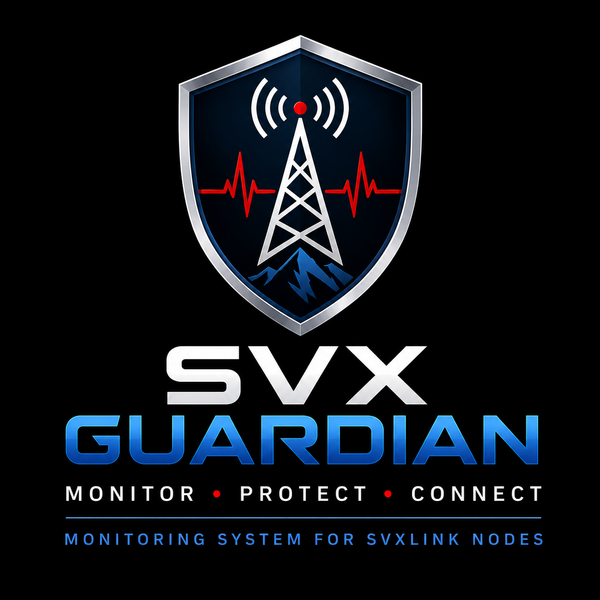

<p align="center">
  
</p>

<h1 align="center">SVX Guardian</h1>

<p align="center">
<b>Built by radio amateurs, for radio amateurs.</b>
</p>

<p align="center">
Open Source Monitoring Platform for SvxLink Radio Nodes
</p>

---

## Overview

SVX Guardian is an open-source monitoring platform designed for **SvxLink** radio nodes.

Its goal is to provide real-time supervision of the entire node, including:

- Raspberry Pi health
- SvxLink service
- EchoLink status
- Reflector connectivity
- System logs
- Notifications
- Web dashboard

The project is designed to be lightweight, modular and easily extensible.

---

## Current Features

- ✅ Raspberry Pi system monitoring
- ✅ CPU temperature
- ✅ CPU usage
- ✅ RAM usage
- ✅ Disk usage
- ✅ System uptime

---

## Planned Features

- SvxLink service monitoring
- EchoLink monitoring
- Reflector monitoring
- Log analyzer
- REST API
- Responsive web dashboard
- Telegram notifications
- Email notifications
- MQTT support
- Multi-language interface
- Automatic installer

---

## Current Status

**Current Release**

```
v0.1.0
```

Development progress:

- ✅ Core framework
- ✅ Guardian Engine
- ✅ System Monitor
- 🔄 SvxLink Monitor (next release)

---

## Project Structure

```text
svxguardian/
├── config/
├── docs/
│   ├── images/
│   └── ROADMAP.md
├── src/
├── systemd/
├── tests/
├── web/
└── requirements.txt
```

---

## Requirements

- Raspberry Pi OS
- Python 3.13+
- SvxLink
- Git

---

## Installation

Clone the repository

```bash
git clone git@github.com:IU5HJU/svxguardian.git
cd svxguardian
```

Create a virtual environment

```bash
python3 -m venv .venv
source .venv/bin/activate
```

Install dependencies

```bash
pip install -r requirements.txt
```

Run the application

```bash
python src/main.py
```

---

## Development Workflow

Every new feature follows the same development cycle.

1. Design
2. Implementation
3. Testing
4. Git Commit
5. GitHub Push

This guarantees that every released version remains stable.

---

## Roadmap

See:

```text
docs/ROADMAP.md
```

---

## Long-Term Vision

SVX Guardian aims to become the reference monitoring platform for SvxLink radio nodes.

The software is designed to be:

- reliable
- modular
- lightweight
- extensible
- easy to install
- open source

---

## Contributing

Ideas, pull requests and bug reports are always welcome.

If you are a radio amateur and would like to improve SVX Guardian, your contribution is appreciated.

---

## License

Released under the MIT License.

---

## Author

**Michele Maccaoni – IU5HJU**

GitHub:

https://github.com/IU5HJU

---

<p align="center">

**73!**

</p>
